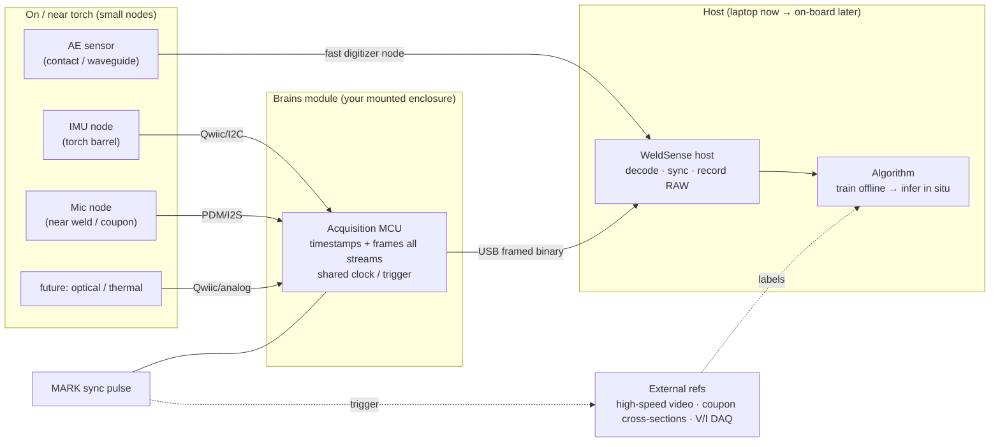
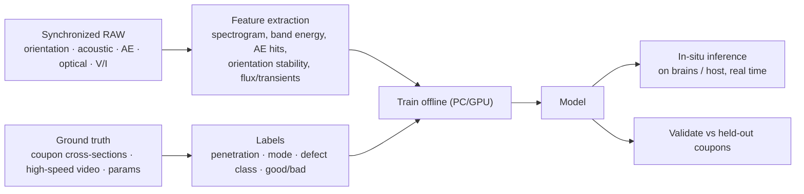

# WeldSense — System Architecture

**Research goal:** train an algorithm to characterize laser welds *in situ* — mode,
penetration, and defects — from multi-modal sensing on/near a handheld or
fixtured torch.

**Design goal:** a **modular** sensor platform. Sensing elements are small,
placement-optimized nodes (IMU on the barrel, microphone by the weld); the
"brains" is a separate mounted module. Nodes interlink with the brains through
standard connectors and custom harnessing/mounts. The compute is **not** tied to
one chip.

**Division of concern:** the *algorithm* is the research contribution; the
*equipment* is the enabling instrument. This document describes the instrument
and the data pipeline that feeds the algorithm.

---

## 1. Principles

1. **Raw first.** Every node streams raw measurements; all calibration, fusion,
   feature extraction, and inference happen downstream. A weld is not repeatable
   on demand — never throw away information at capture time.
2. **Node-agnostic host.** The host decodes *typed, timestamped* packets and
   syncs everything on one clock. Adding a sensor = adding a packet type and a
   handler, never a redesign.
3. **Modular by connector standard.** Low-rate digital sensors share one bus
   (Qwiic/I²C); high-rate/analog sensors get dedicated lines or their own
   digitizer node. Mounts + harnessing are mechanical, not PCB, work.
4. **One timeline.** A shared hardware sync (`MARK`) pins a common `t=0` across
   every node *and* external instruments (high-speed video, lab DAQ).
5. **Ground-truth-driven.** Acoustic/orientation signatures mean nothing without
   labels; each trial is tied to coupon cross-sections and high-speed video.

---

## 2. Topology

The current **XIAO nRF52840 Sense** is *Phase 0*: it collapses the IMU node, the
mic node, and the brains into one taped-on board. The modular design splits those
roles while keeping the exact same host and data format.

---

## 3. Nodes

### 3.1 Sensor nodes
| Node | Placement | Interface | Notes |
|---|---|---|---|
| **IMU** | torch barrel | Qwiic/I²C | orientation of the torch; small, low-rate |
| **Microphone** | near weld / on coupon fixture | PDM or I²S (digital) | audible band; keep short cable to brains |
| **Ultrasonic AE** | contact-coupled to fixture / waveguide | own fast digitizer node | ≥40 kHz–1 MHz; needs its own high-speed digitizer, synced by `MARK` |
| **Optical (future)** | line-of-sight to plume/keyhole | photodiode → analog/ADC | plume & keyhole light; cheap, fast, diagnostic |
| **Thermal (future)** | melt-pool view | Qwiic/analog | melt-pool temperature proxy |
| **V/I (existing lab)** | welding power supply | lab DAQ | correlate arc electrical behavior; sync via `MARK` |

### 3.2 Brains module
The acquisition hub, in a mount of your design off the torch (belt / arm / robot).
Requirements: deterministic multi-sensor sampling, one timestamp source, USB
streaming to host, headroom for on-board inference later.

| Option | Why | Trade |
|---|---|---|
| **Teensy 4.1** *(recommended)* | 600 MHz, rich I/O, fast ADC, USB High-Speed, TinyML-capable | MCU-class; big models need help |
| **Raspberry Pi 5 / Zero 2 W** | full Linux/Python, runs larger models in situ | less deterministic sampling; more power/size |
| **XIAO nRF52840 Sense** | Phase-0 stepping stone (IMU+mic+brains in one) | single-chip ceiling; becomes one node |

### 3.3 Interconnect
- **Qwiic / STEMMA-QT (I²C)** for low-rate digital sensors: keyed 4-pin plug-in
  cables, huge OTS breakout ecosystem, daisy-chainable — swappable nodes with no
  signal soldering. *Caveat:* I²C is length-limited (~0.3–0.5 m practical);
  for longer torch-to-brains runs use an active I²C extender or digitize at the
  node.
- **Dedicated shielded lines** for mic (PDM/I²S) and analog sensors; route away
  from laser/robot power leads (EMI).
- **`MARK` sync line** (a GPIO from the brains): injects a timestamped marker
  packet, fires external triggers (video/DAQ), and can flash an in-frame LED —
  one shared `t=0` everywhere.

---

## 4. Data & synchronization

- **Wire format:** framed binary, little-endian, CRC16, per-type sequence
  numbers, self-describing CONFIG packet. See [README](README.md#binary-protocol).
- **Clock:** each node timestamps from one monotonic microsecond clock; the host
  reconstructs per-sample times from block timestamps + known rates.
- **Cross-instrument sync:** the `MARK` pulse gives data, high-speed video, and
  any lab DAQ a common reference instant.
- **Per-trial record:** raw streams + `metadata.json` linking **coupon ID**,
  **measured penetration** (cross-section), **high-speed video filename/fps**,
  and **weld parameters**. The labeled dataset is the project's core asset.

---

## 5. The algorithm pipeline (the research contribution)

**Stages**
1. **Collect** synchronized raw from every modality + ground truth per trial.
2. **Label** from cross-sections (penetration depth, defect class) and
   high-speed video (event-level: spatter, mode transitions, burn-through).
3. **Feature stage first.** With few, expensive-to-label welds, start with
   interpretable features (spectral centroid/flatness/band ratios, AE hit rate &
   energy, orientation) + simple classifiers. Move to spectrogram CNNs /
   multi-modal fusion nets as the dataset grows.
4. **Validate by trial/coupon split** (never mix frames from one weld across
   train/test) against the cross-section ground truth.
5. **Deploy in situ:** port the trained model to the brains (TinyML) or run it
   live on the host; output a real-time penetration/quality estimate.

**Honest sensing boundary:** the on-board MEMS mic is audible-band
(≤ ~8 kHz at 16 kHz, ~20.8 kHz at 41.667 kHz). The ultrasonic keyhole bands
(~40–110 kHz) most *penetration* studies use require the contact AE node + a fast
digitizer. Multi-modal fusion is both better ML and a stronger system than any
single sensor. See [README](README.md#reading-weld-audio) for the literature.

---

## 6. Roadmap

| Phase | Hardware | Milestone |
|---|---|---|
| **0 — now** | XIAO (IMU+mic+brains, taped to torch) | working capture + dashboard + analysis; first labeled trials |
| **1 — modularize** | Teensy brains + Qwiic IMU node + mic node | split roles; same host/format; harness + mounts |
| **2 — ultrasonic** | contact AE sensor + fast open digitizer (Analog Discovery 3 / Red Pitaya) | reach keyhole/AE bands; `MARK` sync with video |
| **3 — multimodal + in situ** | add optical/thermal/(V-I); on-board inference | fused model, live weld characterization |

**Do-now (while on Phase 0), so nothing gets boxed in:**
- Save every trial's raw + labels (coupon ID, penetration, video, params).
- Treat Qwiic/I²C as the node standard now (even the XIAO IMU is conceptually a node).
- Bake in the `MARK` sync from trial 1 so multi-node/video alignment is automatic.

---

## 7. Candidate bill of materials (indicative)

| Role | Candidate | Interface |
|---|---|---|
| Brains | Teensy 4.1 | USB-HS to host |
| IMU node | LSM6DS3 / ISM330 / LSM6DSV Qwiic breakout | I²C |
| Mic node | PDM/I²S MEMS mic breakout | PDM/I²S |
| AE sensor | active wideband AE (integrated preamp, e.g. MISTRAS WDI / Vallen) | coax → digitizer |
| AE digitizer | Digilent Analog Discovery 3 *(start)* / Red Pitaya STEMlab 125-14 | USB / Ethernet, Python API |
| Optical (future) | photodiode + transimpedance breakout | analog/ADC |
| Sync | GPIO `MARK` + LED + trigger fan-out | wire |

*This is a starting scope, not a final parts list — rates and models get pinned
as each phase is built.*
